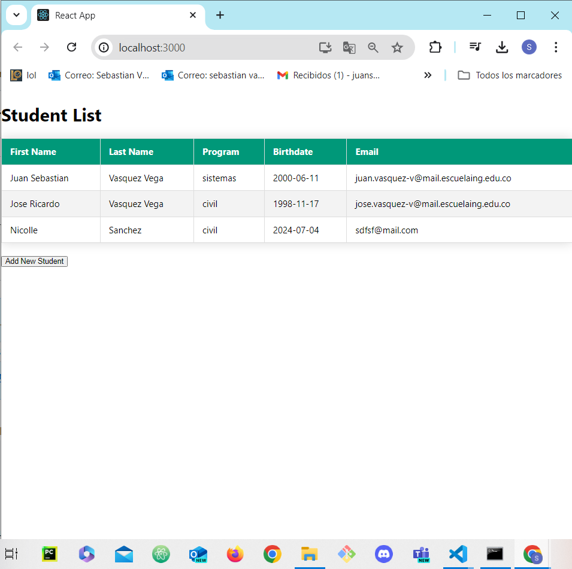
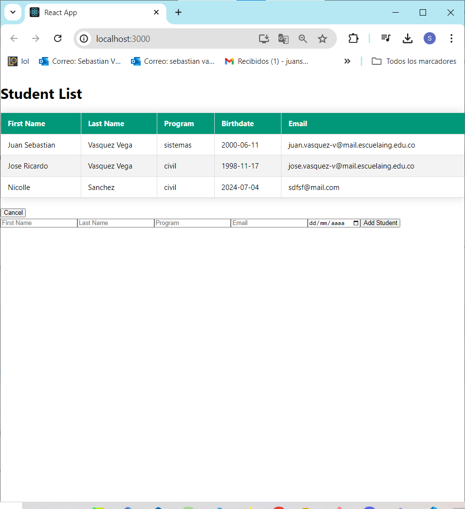
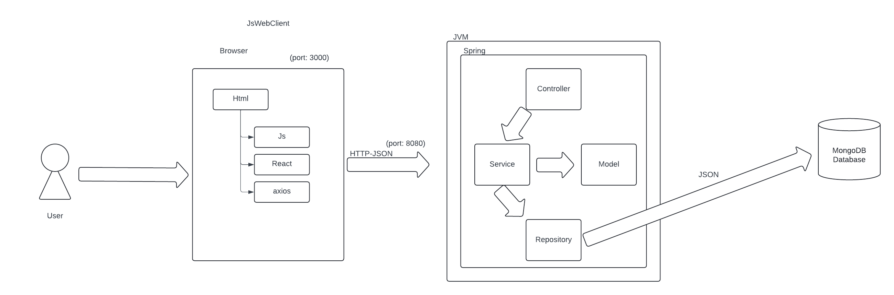

# Student Management System - MongoDB

This repository contains a full-stack application for managing student data. The backend is built using Spring Boot and provides RESTful APIs for fetching and adding student information. The frontend is built using React and displays the student data in a table format, allowing users to view the list of students and add new students through a form.

## Features

- **Backend (Spring Boot)**
  - RESTful API to fetch the list of students.
  - RESTful API to add a new student.
  - Cross-Origin Resource Sharing (CORS) enabled for communication with the frontend.
  
- **Frontend (React)**
  - Fetches and displays the list of students in a table.
  - Form to add a new student.
  - Responsive design with a blue color theme for the table.
  - Uses hooks like `useState` and `useEffect` for state management and side effects.

## Backend Endpoints

- `GET /getAllStudents`: Fetches the list of all students.
- `POST /addNewStudents`: Adds a new student.

## Getting Started
Download the project from 
[The repository.](https://github.com/Sebasvasquezz/Student-Management-System)

You can also clone the file using the following command.

```
git clone https://github.com/Sebasvasquezz/Student-Management-System 
```

### Prerequisites

* [Maven](https://maven.apache.org/): Automate and standardize the life flow of software construction

* [Git](https://www.git-scm.com/): Decentralized Configuration Manager

* [Node](https://nodejs.org/en/): A JavaScript runtime built on Chrome's V8 engine, enabling server-side scripting and development of scalable network applications.

### Installing
1. Maven
    * Download Maven in http://maven.apache.org/download.html
    * You need to have Java installed (7 or 8)
    * Follow the instructions in http://maven.apache.org/download.html#Installation

2. Git
    * Download git in https://git-scm.com/download/win
    * Follow the instructions in https://git-scm.com/book/en/v2/Getting-Started-Installing-Git

3. Node
    * Download Node in https://nodejs.org/en
    * Follow the instructions in https://nodejs.org/en/learn/getting-started/how-to-install-nodejs

### Build the project

Once you have the cloned project in your repository. Follow the steps below to launch the program successfully.

#### Run BackEnd Spring-boot

1. Open a terminal and enter the folder where you clone the repository and enter the back folder.

2. Use the following command to removes files generated in previous builds, compiles the code and packages the project into a JAR or WAR file ready for distribution.
    ```
    mvn clean package
    ```
3. Now you can run the project using the following command.

    ```
    mvn spring-boot:run
    ```

#### Run FrontEnd React Js

1. Open a terminal and enter the folder where you clone the repository and enter the front folder.

2. Use the following command to install dependencies
    ```
    npm install
    ```
3. Now use the following command start proyect

    ```
    npm start
    ```

4. Now open a browser and go to the following [link](http://localhost:3000/) to see the student list:

5. You also can click the button "Add New Student" to add a new student:

## Usage

- Open the application in your browser at `http://localhost:3000`.
- View the list of students displayed in a table.
- Click the "Add New Student" button to display the form.
- Fill out the form and submit to add a new student.
- The new student will appear in the table upon successful addition.

## Proyect Structure

### BackEnd Spring-boot

- **StudentsTableApplication**: Main application class for the Spring Boot application.

- **StudentController**: Controller class that handles incoming HTTP requests related to students. It provides endpoints to fetch all students and add new students.

- **Student**: Entity class that represents a student. It contains attributes like `firstName`, `lastName`, `program`, `mail`, and `birthdate`.

### FrontEnd React Js

- **App**: The `App` component is the main component in the frontend React application. It manages the state for displaying a list of students and a form to add new students. The component fetches student data from a backend server using Axios for HTTP requests. It renders a responsive table to display student information, including fields such as first name, last name, program, email, and birthdate. Users can toggle the display of the student addition form by clicking a button. This component utilizes React hooks like `useState` and `useEffect` to manage state and handle side effects such as data fetching and form submission.


## Architectural Design



### Data Flow

#### Frontend (React)
1. Initial Load and Fetching Students:

    * Upon application startup (useEffect in App.js), a GET request is made to http://localhost:8080/getAllStudents to fetch the current list of students from the backend.
    * The list of students is stored in the local state students using setStudents.

2. Displaying Students in a Table:
    * A table is rendered in the App.js component, where each row represents a student.
    * Student data is fetched from the students state and mapped to create rows in the table.
3. Adding a New Student:

    * Clicking the "Add New Student" button displays a form.
    * The user fills out the form and submits the data.
    * Form data is captured in the newStudent state.
    * Upon form submission, a POST request is made to http://localhost:8080/addNewStudents with the new student data.
    * After successfully adding the student, the list of students is updated by calling fetchStudents() to reload the updated data from the backend.
#### Backend (Spring Boot)
1. Student Controller (StudentController.java):

    * GET /getAllStudents: Handles the request to fetch all students. Calls the studentService to retrieve the list of students from the database and returns it as a JSON list.
    * POST /addNewStudents: Handles the request to add a new student. Student data is sent in the request body (@RequestBody). Calls the addNewStudent method of studentService to add the student to the database.
2. Student Service (StudentService.java):

    * getAllStudents(): Logic to fetch all students from the database.
    * addNewStudent(): Logic to add a new student to the database using the provided parameters.
3. Data Access (StudentRepository.java):

    * Interacts directly with the database (MongoDB in this case) to perform CRUD (Create, Read, Update, Delete) operations related to students.

## Built with

* [Maven](https://maven.apache.org/) - Dependency management
* [Node](https://nodejs.org/en/) - JavaScript runtime for building scalable network applications.

## Authors

* **Juan Sebastian Vasquez Vega**  - [Sebasvasquezz](https://github.com/Sebasvasquezz)

## Date

Jule 05, 2024

## License

This project is licensed under the GNU License - see the [LICENSE.txt](LICENSE.txt) file for details.